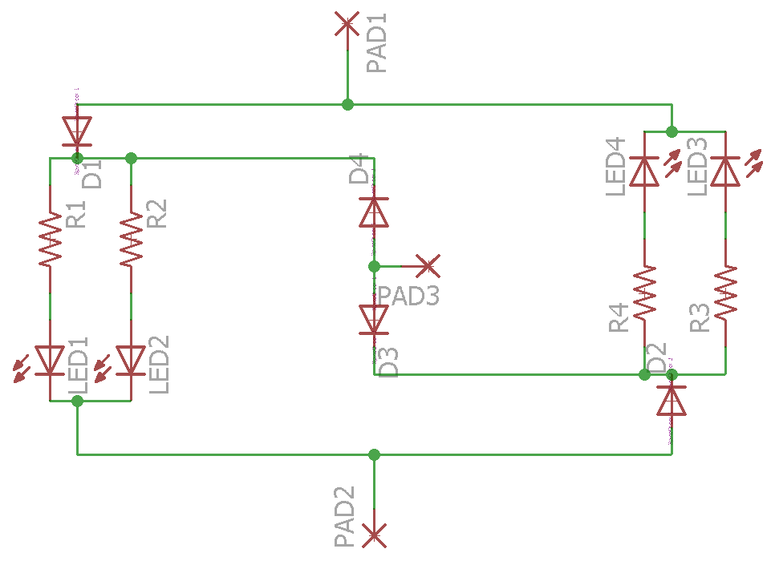

# HST-lighting-upgrade-board

A PCB allowing the lighting to be upgraded from the standard bulb - fits the old Hornby/Lima class 43 (Intercity 125) with the ringfield motor.

Distributed as an Eagle project.

For analogue operation, ignore PAD3 (DCC common) at the bottom, and solder wires from each rail to the two pads at the top.

For DCC operation, assuming standard wiring conventions, connect the blue wire to DCC common, the white wire to the left hand pad at the top, and the yellow wire to the right hand pad at the top.

